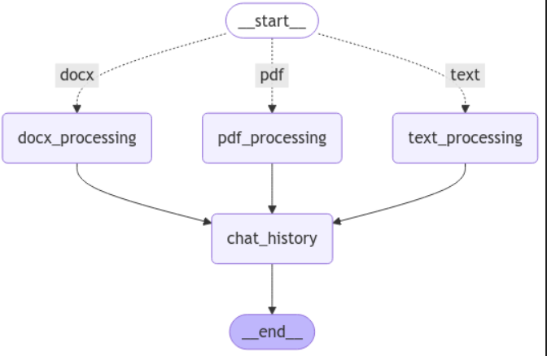
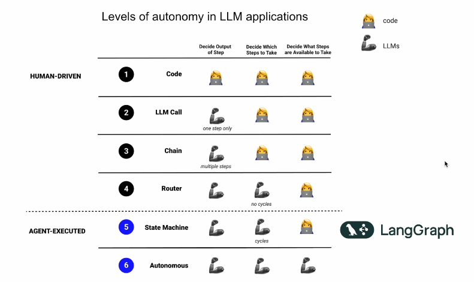

# **Finance Document Reader Chatbot** 

## **Objective***
The objective is to build a financial document reader tool
augmented by IA. The final product should be able to
classify or summarize documents, discover predefined topics, recognize named
entities or answer questions related to the provided document.

The Proof of Concept (PoC) should demonstrate how the tool can parse and extract financial entities from documents.
Depending on the nature of the provided document you can use a rule-based parser, a
NER model or a Large Language Model (LLM)

###Architecture WI
The first expected work item is a Global Architecture Document (GAD) that describes the interactions
between the CMI Information System (IS) components and the document reader. The reader can be invoked
programatically via APIs, and will also provide a User Interface (UI) enabling end users to upload a document and launch a
classification, summarization, topic modelling, NER or Q&A feature. Documents will vary in size, format and level of
confidentiality. They can be sent through different communication channels and processed in a synchronous or
asynchronous way.

### Handling Docx file
 Some kind of documents (e.g. docx files) can be processed by a rule-based parser coded in Python. For this
work item, the expected artifact is a program that takes a document as input and returns a set of named entity values. The
entities to extract are listed in the next slide. You can choose which Python packages to use and the format of the output
files.

### Handling .txt file
Other kind of documents (e.g.chats) can be processed by a NER model. This work item is a combination of
Python code and a Global Methodology Document (GMD). The Python code will give an overview of how to download and
run a general-purpose NER model to extract named entities. You can choose which model to use. The methodology
document will explain how this model can be fine-tuned to extract the financial entities listed in the next slide.

## Handling PDF file 
The last type of documents (e.g. pdf files) are more verbose, unstructured and require a more
advanced language model. For this work item a GMD will explain how to build an entity extraction pipeline that relies on
LLMs. The document will also include a description of the prompting and/or Retrieval-Augmented Generation (RAG)
techniques to be used.

## Soltuion 

Tools & Technologies 

Streamlit - For frontend 
Fastapi - For backend
Langchain & Langgraph : Here the using the langchain agents to decide what action to be taken based on the input file format.

If the format is docx, we use regex expressions to extract the data required.

If the format is txt, we use NER via Spacy library to extract the required field. 
Here we have tries using the EntityRuler to extract the information. 

Same coule be achieved via Matcher or ParseMatcher or via a customize training of the NLP model. 

For the pdf, we call OpenAI LLM and extract the entities and get the summary of the doucments. 
We can also ask the questions based on the documents uploaded. 
We use basic RAG methodology here. 

 
To process the docx file , we use the basic Rule based Parser like Regex expersions

